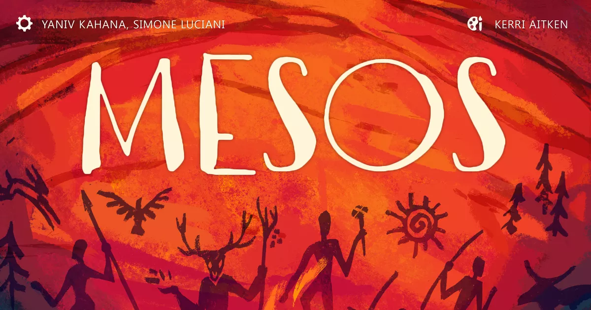
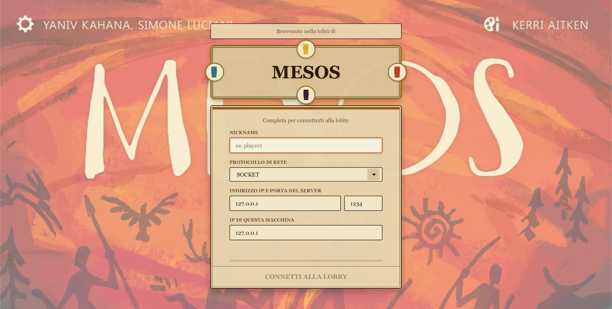
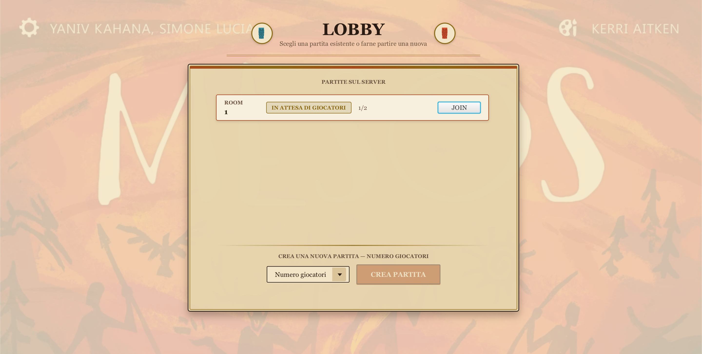
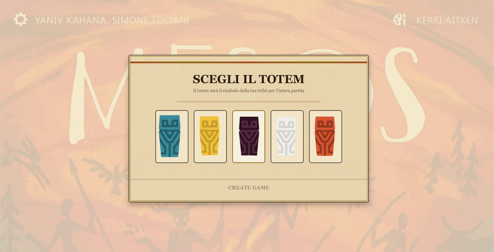
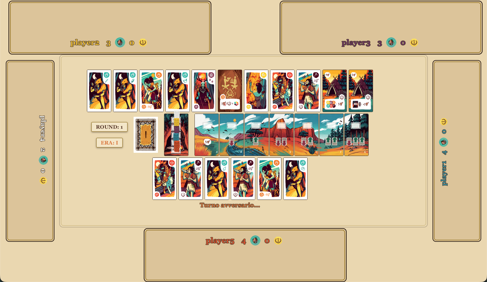
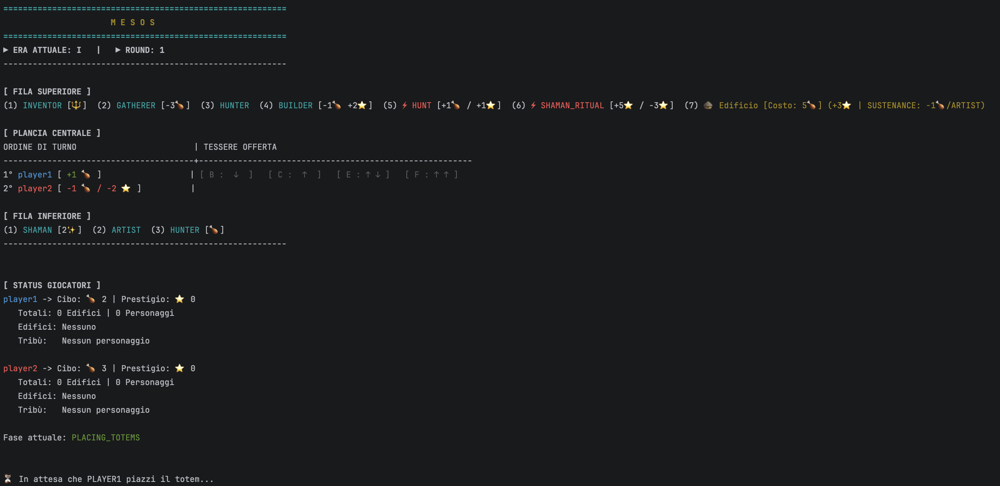

<p align="center">
  
</p>

<h1 align="center">Mesos</h1>

<p align="center">
  A distributed, multiplayer Java implementation of the <em>Mesos</em> board game.<br>
  Final project — Software Engineering Course, Politecnico di Milano (2026) — <b>Grade: 30/30</b>
</p>

<p align="center">
  
  
  
  
</p>

---

## Table of Contents

- [Overview](#overview)
- [Authors](#authors)
- [Architecture](#architecture)
- [Technology Stack](#technology-stack)
- [Features](#features)
- [Project Structure](#project-structure)
- [Screenshots](#screenshots)
- [Getting Started](#getting-started)
- [Testing](#testing)
- [Legal Disclaimer](#legal-disclaimer)

---

## Overview

Mesos Board Game is a distributed Java application implementing the digital version of the Mesos board game from Cranio Creations. This project was developed as part of the final project for the Software Engineering course at Politecnico di Milano during the Academic Year 2025/2026.

The application provides a complete multiplayer board game experience with support for both Graphical User Interface (GUI) and Command-Line Interface (CLI) clients, communicating with a centralized server through RMI and Socket protocols.

Additional features has been developed 

---

## Authors

- [Mattia Zonzin](https://github.com/mattiazonzin)
- [Luca Pellegrini](https://github.com/LucaPelle01)
- [Anna Samarani](https://github.com/annasamarani)
- [Alberto Roveda](https://github.com/Albi0607)

---

## Architecture

The application follows an **MVC architecture** adapted for a networked, multi-client environment:

[Final UML](deliverables/UML/Mesos_UML_model_controller.pdf)

- **Model** — encapsulates the game rules and state (board, decks, players, tribes) and is completely unaware of networking or rendering.
- **Controller** — validates and applies player actions, driving transitions in the game's state machine.
- **View** — two independent implementations (CLI and JavaFX GUI) rendering a lightweight `ClientModel` kept in sync with the server.
- **Network layer** — abstracts RMI and Socket behind a common `VirtualView` / `Network` interface, so the Controller and View never depend on the transport protocol directly.
- **Persistence** — periodically serializes game state to disk and replays a move log to restore matches after a server restart.
- **DB** — a DAO layer over MySQL for match results and leaderboard queries.

---

## Technology Stack

| Layer | Technology |
| :--- | :--- |
| Language | Java 21 |
| Build tool | Maven |
| GUI | JavaFX (FXML + CSS) |
| Networking | Java RMI, TCP Sockets |
| Serialization | Jackson, Gson |
| Persistence | Custom disk-based state serializer + move log |
| Database | MySQL (JDBC) |
| Testing | JUnit 5 |

---

## Features

### Mandatory Features

| Feature | Status |
| :--- | :---: |
| Complete game rules | ✅ |
| Text User Interface (TUI) | ✅ |
| Graphical User Interface (GUI, JavaFX) | ✅ |
| RMI communication | ✅ |
| Socket communication | ✅ |

### Advanced Features

| Feature | Status | Description |
| :--- | :---: | :--- |
| **Match ranking database** | ✅ | Completed matches are stored in MySQL (nickname, score, date, player count); players can browse the leaderboard filtered by match size. |
| **Multiple concurrent matches** | ✅ | The server hosts several independent games at once, with players able to join an existing lobby or create a new one. |
| **Persistence** | ✅ | Game state is periodically checkpointed to disk; interrupted matches can be restored after a server restart. |
| **Disconnection resilience** | ✅ | Disconnected players can reconnect and resume play; their turns are automatically skipped in the meantime. If every player but one disconnects, the match is suspended until someone reconnects. |

---

## Project Structure

```
it.polimi.ingsw.mesos
├── model/           # Game rules and state (Board, Player, Tribe, Cards, Deck, State machine)
├── controller/       # Action validation and orchestration
├── view/             # CLI and JavaFX GUI clients
├── network/          # Protocol-agnostic client/server networking abstractions
├── RMI/               # Java RMI implementation
├── socket/            # Custom TCP socket protocol and message types
├── multipleGames/      # Lobby management and concurrent match handling
├── persistence/        # State serialization and move-log based recovery
├── DB/                 # MySQL DAO layer and leaderboard service
└── common/              # Shared DTOs and enums between client and server
```

---

## Screenshots

<table>
  <tr>
    <th width="15%" align="left">Interface</th>
    <th width="85%" align="center">Screenshot</th>
  </tr>
  <tr>
    <td align="center"><b>Login</b></td>
    <td align="center"></td>
  </tr>
  <tr>
    <td align="center"><b>Lobby</b></td>
    <td align="center"></td>
  </tr>
  <tr>
    <td align="center"><b>Totem Selection</b></td>
    <td align="center"></td>
  </tr>
  <tr>
    <td align="center"><b>GUI Gameplay</b></td>
    <td align="center"></td>
  </tr>
  <tr>
    <td align="center"><b>CLI Gameplay</b></td>
    <td align="center"></td>
  </tr>
</table>

---

## Getting Started

### Requirements

- Java 21 or later
- (Optional) A MySQL instance, to enable the ranking database

### Build

```bash
mvn clean package
```

### Run the Server

```bash
java -jar Mesos-Server.jar
```

At startup you will be asked to:

1. Enter the IP address of the machine running the server.
2. Enter a MySQL username and password to enable the ranking database *(optional — press Enter to skip and run without database support)*.

Once running, the server listens on:

- **RMI** — port `1099`
- **Socket** — port `1234`

### Run the CLI Client

```bash
java -jar Mesos-Client-CLI.jar
```

At startup you will be asked to:

1. Enter the server's IP address.
2. Enter the IP address of the machine running the client.
3. Choose the connection protocol (RMI or Socket).
4. Enter a unique nickname.

### Run the GUI Client

```bash
java -jar Mesos-Client-GUI.jar
```

At startup you will be asked to:

1. Enter a unique nickname.
2. Choose the connection protocol (RMI or Socket).
3. Enter the server's IP address and port (pre-filled based on the selected protocol).
4. Enter the IP address of the machine running the client.
5. Press the connect button.

---

## Testing

The project includes a JUnit 5 test suite covering the model, deck-generation strategies, character/event/building card effects, and database access, including a dedicated integration test (`MesosIntegrationTest`) exercising a full game flow.

```bash
mvn test
```

---

## Legal Disclaimer

The Mesos board game and all related graphic materials are the exclusive property of Cranio Creations. This project is an unofficial, non-commercial implementation developed exclusively for academic purposes, with no intention of infringing on the rights of the copyright holder.

*Il gioco da tavolo Mesos e tutto il relativo materiale grafico è di esclusiva proprietà di Cranio Creations.*
